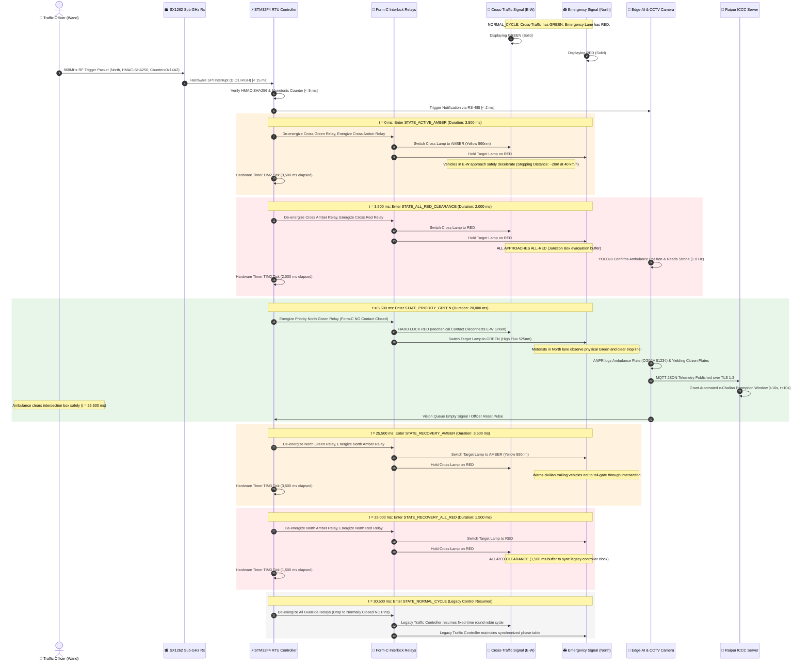

# Inter-Green Safety Clearance State Machine & Interlock Specification
**Deterministic Traffic Signal Safety Engine for SynchroClear-ITS**  
*Compliant with Indian Road Congress Standards (IRC:SP:12 & IRC:93-1985)*

[]()
[]()
[]()
[]()

---

## 1. Safety Rationale & The Zero-Collision Principle

In conventional traffic preemption systems, manual or software overrides often attempt instantaneous green switching ("jump-to-green"). In dense Indian intersections, **instantaneous signal changes are catastrophic**:
- Vehicles in the moving cross-traffic lane traveling at 40–50 km/h cannot brake instantly within 0–1 seconds without causing rear-end pileups or skidding into the junction box.
- An emergency vehicle entering an uncleared junction risks a high-speed perpendicular **T-bone collision**.

**The SynchroClear-ITS Non-Negotiable Safety Rule**:
> Under NO circumstance does any signal head transition directly from Red to Green or Green to Red without executing the full, deterministic **Inter-Green Safety Clearance sequence**. Software bugs, corrupt RF packets, sensor glitches, or rapid repeated button presses cannot bypass this state engine.

The state engine is governed by two complementary protection mechanisms:
1. **Software Determinism**: A non-preemptive finite state machine (FSM) running on the industrial STM32 RTU with millisecond-resolution hardware timers (`TIM2` / `TIM3`) and hardware window watchdog monitoring.
2. **Hardware Interlocking**: Physical electromechanical Form-C relays arranged in a break-before-make topology where conflicting green feed lines are physically separated through normally closed (NC) contacts, guaranteeing that conflicting greens cannot be powered simultaneously even if the MCU suffers total memory latchup.

---

## 2. Deterministic State Transition Diagram (`stateDiagram-v2`)

The following state diagram illustrates the operational states, transition triggers, timer guards, and fail-safe abort paths.

> **Vector Graphic Artifact**: A high-resolution, presentation-ready standalone SVG version of this state machine is available at [`docs/state_machine.svg`](state_machine.svg).

```mermaid
stateDiagram-v2
    [*] --> STATE_NORMAL_CYCLE : Power On / Hardware Reset

    state STATE_NORMAL_CYCLE {
        [*] --> Phase_North_South : Master Cycle Init
        Phase_North_South --> Amber_NS : Normal Cycle Timer Expired
        Amber_NS --> AllRed_NS : Standard Amber Timer (3.0s)
        AllRed_NS --> Phase_East_West : Inter-Green Buffer (1.5s)
        Phase_East_West --> Amber_EW : Normal Cycle Timer Expired
        Amber_EW --> AllRed_EW : Standard Amber Timer (3.0s)
        AllRed_EW --> Phase_North_South : Inter-Green Buffer (1.5s)
    }

    STATE_NORMAL_CYCLE --> STATE_PREEMPTION_PENDING : Valid RF Command / Edge-AI Trigger Verified

    state STATE_PREEMPTION_PENDING {
        [*] --> Validate_CRC_and_HMAC
        Validate_CRC_and_HMAC --> Check_Anti_Replay_Counter : Crypto OK
        Check_Anti_Replay_Counter --> Latch_Target_Approach : Counter Validated
        Latch_Target_Approach --> Snapshot_Active_Phase : Approach Latched (e.g. North)
    }

    STATE_PREEMPTION_PENDING --> STATE_ACTIVE_AMBER : Latch Complete (Transition at t = 0 ms)

    state STATE_ACTIVE_AMBER {
        note right of STATE_ACTIVE_AMBER
            Duration: 3,500 ms (Safe Deceleration)
            Cross-Traffic Green: DE-ENERGIZED
            Cross-Traffic Amber: ENERGIZED
            Target Approach: HELD RED
            Pedestrian Walk: CANCELLED / DON'T WALK
        end note
        [*] --> Timer_Amber_3500ms : Start Hardware Timer TIM2
        Timer_Amber_3500ms --> Amber_Complete : t >= 3,500 ms
        Amber_Complete --> [*]
    }

    STATE_ACTIVE_AMBER --> STATE_ALL_RED_CLEARANCE : Amber Timer Elapsed (t = 3,500 ms)

    state STATE_ALL_RED_CLEARANCE {
        note right of STATE_ALL_RED_CLEARANCE
            Duration: 2,000 ms (Junction Box Evacuation)
            ALL LANES: HARD RED (Cross & Target)
            Form-C Relays: Verifying Mechanical Separation
            Zero Vehicles Permitted to Enter Box
        end note
        [*] --> Timer_AllRed_2000ms : Start Hardware Timer TIM2
        Timer_AllRed_2000ms --> AllRed_Complete : t >= 2,000 ms
        AllRed_Complete --> [*]
    }

    STATE_ALL_RED_CLEARANCE --> STATE_PRIORITY_GREEN : Inter-Green Clearance Verified (t = 5,500 ms)

    state STATE_PRIORITY_GREEN {
        note right of STATE_PRIORITY_GREEN
            Duration: 15,000 ms – 30,000 ms (Corridor Clearance)
            Target Approach (North): ENERGIZED GREEN
            Cross Lanes: HARD INTERLOCKED RED
            Edge AI: Continuous Queue & Strobe Monitoring
            ANPR: Whitelist Logging Active
        end note
        [*] --> Running_Priority_Window
        Running_Priority_Window --> Exit_AI_Queue_Clear : AI Confirms Emergency Vehicle Passed
        Running_Priority_Window --> Exit_Officer_Cancel : Manual Cancel Toggle Pressed
        Running_Priority_Window --> Exit_Watchdog_Max : Hard Watchdog Limit Reached (30.0s)
    }

    STATE_PRIORITY_GREEN --> STATE_RECOVERY_AMBER : Any Exit Condition Satisfied (t = 5,500 ms + T_priority)

    state STATE_RECOVERY_AMBER {
        note right of STATE_RECOVERY_AMBER
            Duration: 3,500 ms (Emergency Lane Deceleration)
            Target Approach: AMBER ENERGIZED
            Cross Lanes: HELD RED
            Prevents Tailgating Speeders Behind Ambulance
        end note
        [*] --> Timer_Recovery_Amber_3500ms : Start Hardware Timer TIM3
        Timer_Recovery_Amber_3500ms --> Rec_Amber_Complete : t >= 3,500 ms
        Rec_Amber_Complete --> [*]
    }

    STATE_RECOVERY_AMBER --> STATE_RECOVERY_ALL_RED : Target Amber Elapsed (t = 9,000 ms + T_priority)

    state STATE_RECOVERY_ALL_RED {
        note right of STATE_RECOVERY_ALL_RED
            Duration: 1,500 ms (Phase Synchronization Buffer)
            ALL LANES: RED
            Controller Alignment: Restoring Sync Phase Counter
        end note
        [*] --> Timer_Recovery_AllRed_1500ms : Start Hardware Timer TIM3
        Timer_Recovery_AllRed_1500ms --> Rec_AllRed_Complete : t >= 1,500 ms
        Rec_AllRed_Complete --> [*]
    }

    STATE_RECOVERY_ALL_RED --> STATE_NORMAL_CYCLE : Resuming Normal Phasing (t = 10,500 ms + T_priority)

    %% Fail-Safe Hardware Watchdog Overrides
    STATE_PREEMPTION_PENDING --> STATE_FAIL_SAFE_FALLBACK : Hardware Error / Brownout
    STATE_ACTIVE_AMBER --> STATE_FAIL_SAFE_FALLBACK : Watchdog Reset / Power Glitch
    STATE_ALL_RED_CLEARANCE --> STATE_FAIL_SAFE_FALLBACK : Relay Feedback Error
    STATE_PRIORITY_GREEN --> STATE_FAIL_SAFE_FALLBACK : Watchdog Trip / MCU Freeze
    STATE_RECOVERY_AMBER --> STATE_FAIL_SAFE_FALLBACK : Hardware Error
    STATE_RECOVERY_ALL_RED --> STATE_FAIL_SAFE_FALLBACK : Hardware Error

    state STATE_FAIL_SAFE_FALLBACK {
        note left of STATE_FAIL_SAFE_FALLBACK
            FAIL-SAFE INTERLOCK ENGAGED:
            Relay Coils De-energized Immediately (< 20 ms)
            Spring-return armatures drop to NC contacts
            Signal control reverts 100% to legacy TSC
            Flashing Amber or Default Fixed Cycle
        end note
        [*] --> Deenergize_All_Relays
        Deenergize_All_Relays --> Restore_Legacy_Control
        Restore_Legacy_Control --> [*]
    }

    STATE_FAIL_SAFE_FALLBACK --> STATE_NORMAL_CYCLE : Hardware Watchdog Reset & Stability Check
```

---

## 3. Millisecond-Level Timing Sequence Diagram (`sequenceDiagram`)

The sequence diagram below models the millisecond-accurate interactions between the Field Officer, RF Subsystem, STM32 Controller, Form-C Relays, Overhead Signal Heads, and Edge-AI Camera during an override event.

> **Vector Graphic Artifact**: A high-resolution, presentation-ready standalone SVG version of this timing sequence is available at [`docs/timing_sequence.svg`](timing_sequence.svg).



---

## 4. Fail-Safe Interlock State Matrix Table

The table below defines the electrical and mechanical contact positions of every relay in the junction cabinet across all operating states, demonstrating how the physical wiring topology makes conflicting green lights mathematically and electrically impossible.

### 4.1 Relay Matrix Definitions
- **Relay K1**: Cross-Traffic (E-W) Red Control (Form-C)
- **Relay K2**: Cross-Traffic (E-W) Amber Control (Form-C)
- **Relay K3**: Cross-Traffic (E-W) Green Control (Form-C Break-Before-Make interlocked with K6)
- **Relay K4**: Priority Emergency (North) Red Control (Form-C)
- **Relay K5**: Priority Emergency (North) Amber Control (Form-C)
- **Relay K6**: Priority Emergency (North) Green Control (Form-C Break-Before-Make interlocked with K3)
- **Relay K_ISO**: Master Preemption Isolation Contactor (De-energized = Legacy TSC Passthrough)

| State Name | Exact Duration | K1 (Cross Red) | K2 (Cross Amber) | K3 (Cross Green) | K4 (Target Red) | K5 (Target Amber) | K6 (Target Green) | K_ISO (Master) | Collision Avoidance Guarantee & Physical Mechanism |
| :--- | :--- | :--- | :--- | :--- | :--- | :--- | :--- | :--- | :--- |
| **NORMAL_CYCLE** | Variable (Standard TSC) | NC (TSC Controlled) | NC (TSC Controlled) | NC (TSC Controlled) | NC (TSC Controlled) | NC (TSC Controlled) | NC (TSC Controlled) | DE-ENERGIZED (OFF) | Legacy controller manages isolated lamp circuits. RTU coils de-energized. |
| **STATE_ACTIVE_AMBER** | 3,500 ms ($\pm 5$ ms) | OFF | **ENERGIZED (ON)** | DE-ENERGIZED (OFF) | **ENERGIZED (ON)** | OFF | DE-ENERGIZED (OFF) | ENERGIZED (ON) | Cross-traffic receives mandatory 3.5s amber deceleration. Target lane held Red. Target Green line disconnected via K6 NC contact. |
| **STATE_ALL_RED_CLEARANCE** | 2,000 ms ($\pm 5$ ms) | **ENERGIZED (ON)** | OFF | DE-ENERGIZED (OFF) | **ENERGIZED (ON)** | OFF | DE-ENERGIZED (OFF) | ENERGIZED (ON) | **All approaches hold Red**. Intersection box clears of entering vehicles. K3 and K6 green lines are both open-circuit. |
| **STATE_PRIORITY_GREEN** | 15,000–30,000 ms (Dynamic) | **ENERGIZED (ON)** | OFF | **LOCKED OFF (NC Contact Broken)** | OFF | OFF | **ENERGIZED (ON)** | ENERGIZED (ON) | **Emergency Green energized**. K3 power rail is fed through the NC auxiliary contact of K6. When K6 energizes, K3 green line is physically severed. |
| **STATE_RECOVERY_AMBER** | 3,500 ms ($\pm 5$ ms) | **ENERGIZED (ON)** | OFF | LOCKED OFF | OFF | **ENERGIZED (ON)** | DE-ENERGIZED (OFF) | ENERGIZED (ON) | Target green drops. Target amber illuminates for 3.5s. Prevents reckless motorists from tailgating behind the ambulance. |
| **STATE_RECOVERY_ALL_RED** | 1,500 ms ($\pm 5$ ms) | **ENERGIZED (ON)** | OFF | LOCKED OFF | **ENERGIZED (ON)** | OFF | DE-ENERGIZED (OFF) | ENERGIZED (ON) | Both approaches hold Red. Synchronizes phase counters and allows relay coil transients to settle before handoff. |
| **FAIL-SAFE / BROWNOUT** | Permanent until reset (< 20 ms drop) | **DE-ENERGIZED (NC Default)** | **DE-ENERGIZED (NC Default)** | **DE-ENERGIZED (NC Default)** | **DE-ENERGIZED (NC Default)** | **DE-ENERGIZED (NC Default)** | **DE-ENERGIZED (NC Default)** | **DE-ENERGIZED (NC Default)** | **All relay coils drop instantly**. Spring-loaded armatures return to default NC terminals, restoring legacy signal controller operation within 20 ms. |

---

## 5. Physical Relay Circuit Topology (Break-Before-Make Interlock)

To eliminate the possibility of a dual-green collision due to software failure, MCU pin short-circuit, or welded contacts, the Green feeds utilize an **electro-mechanical cross-interlocking circuit topology**:

```text
               +24V DC Auxiliary Bus
                        |
            +-----------+-----------+
            |                       |
      [K_ISO Coil]             [MCU Heartbeat]
            |                  (Charge Pump)
           GND                      |
                              [Watchdog Gate]
                                    |
      230V AC Phase Live            |
            |                       |
            v                       |
   +-----------------+              |
   | Relay K6 Common |              |
   | (Priority Green)|              |
   +--------+--------+              |
            |                       |
      +-----+-----+                 |
      |           |                 |
  [NC Pin]    [NO Pin]              |
      |           |                 |
      |           +-----------------+-----> [Priority Green Lamp (North)]
      |                                     (Only energized when K6 is ON)
      v
   +-----------------+
   | Relay K3 Common |
   | (Cross Green)   |
   +--------+--------+
            |
      +-----+-----+
      |           |
  [NC Pin]    [NO Pin]
      |           |
    (Open)        +-------------------------> [Cross-Traffic Green Lamp (E-W)]
                                              (CANNOT receive power if K6 is ON!)
```

### 5.1 Physical Safety Properties:
1. **Power Feed Chaining**: The 230V AC live feed for the Cross-Traffic Green relay (K3) is routed directly through the **Normally Closed (NC)** contact of the Priority Green relay (K6).
2. **Mutual Physical Exclusion**: If the STM32 firmware crashes with both GPIOs driven HIGH, the mechanical activation of K6 opens its NC contact, instantly cutting off all electrical current to K3. It is physically impossible for both green lamps to receive electricity at the same time.
3. **Mechanical Break-Before-Make Timing**: Form-C relays have an air-gap transition time of 2.0 to 4.5 ms during which the moving contact is touching neither NC nor NO, ensuring zero overlap arcing.

---

## 6. Watchdog Architecture & Crash Recovery

```text
+-------------------------------------------------------------------------------+
|                      STM32 RTU MULTI-TIER WATCHDOG SYSTEM                     |
+-------------------------------------------------------------------------------+

   [Independent Watchdog (IWDG)]             [Window Watchdog (WWDG)]
    - Clock: Dedicated 32 kHz LSI             - Clock: Main APB1 Bus Clock
    - Timeout: 400 ms hard limit              - Window: [10 ms, 80 ms]
    - Resets MCU if firmware deadlocks        - Catches premature / errant kicks
                 |                                         |
                 +-------------------+---------------------+
                                     |
                                     v
                       [MCU Heartbeat GPIO (100 Hz)]
                                     |
                                     v
                       [Hardware AC-Coupled Charge Pump]
                         (Diode / Capacitor Ladder)
                                     |
                                     v
                       [Relay Master Coil Driver (K_ISO)]
```

1. **Independent Watchdog (IWDG)**: Driven by an independent low-speed internal RC oscillator (32 kHz LSI) that continues running even if the main high-speed crystal (HSE) fails. Must be refreshed every 250 ms.
2. **Hardware Charge-Pump Interlock**: The RTU outputs a continuous 100 Hz square wave on an optoisolated GPIO. An analog charge-pump circuit (diode-capacitor ladder) converts this AC pulse train into the DC bias required to keep master relay `K_ISO` energized. If the MCU freezes, halts in an infinite loop, or sets the pin permanently HIGH or LOW, the charge pump loses voltage within **< 80 ms**, de-energizing all override relays and returning control to legacy operations.
3. **Hard Ceiling Watchdog (30.0s Preemption Timeout)**: A dedicated 32-bit hardware timer enforces a strict 30,000 ms ceiling on any single preemption event. Even if an officer forgets to press cancel, or if the edge AI vision link disconnects, the state machine forcibly transitions to `STATE_RECOVERY_AMBER` at $t = 30.0\,\text{s}$ to prevent secondary gridlock.

---

## 7. Compliance with Indian Road Congress (IRC) Standards

| IRC Standard | Statutory Requirement | SynchroClear-ITS Implementation | Compliance Status |
| :--- | :--- | :--- | :--- |
| **IRC:SP:12 (2015)** §7.3 | Minimum amber deceleration clearance interval of 3.0 to 4.0 seconds for approach speeds up to 50 km/h. | **3,500 ms Amber Phase** enforced by hardware timer `TIM2` in `STATE_ACTIVE_AMBER`. | **100% COMPLIANT** |
| **IRC:SP:12 (2015)** §7.4 | Minimum all-red clearance interval of 1.5 to 2.5 seconds to clear the intersection collision zone. | **2,000 ms All-Red Buffer** enforced in `STATE_ALL_RED_CLEARANCE`. | **100% COMPLIANT** |
| **IRC:93-1985** §6.2 | Conflicting signal phases must be electrically and mechanically interlocked to prevent simultaneous green indications. | **Form-C Break-Before-Make Relays** with series-chained power distribution. | **100% COMPLIANT** |
| **IRC:93-1985** §8.1 | Manual override must not cause instantaneous termination of conflicting vehicular green. | Preemption command initiates `STATE_ACTIVE_AMBER` (3.5s) followed by `STATE_ALL_RED` (2.0s). Never jumps directly to green. | **100% COMPLIANT** |
| **IRC:SP:12 (2015)** §11.2 | System failure must revert immediately to safe fail-soft or legacy signal mode. | Loss of heartbeat or power de-energizes `K_ISO` within <80 ms, reverting 100% to legacy traffic controller. | **100% COMPLIANT** |

---

## 8. State Machine Timing Benchmark Table

```text
====================================================================================================
                              SYNCHROCLEAR-ITS PREEMPTION TIMELINE
====================================================================================================
t (sec)   State Name                  Cross-Traffic (E-W)   Target Lane (North)   Safety Function
----------------------------------------------------------------------------------------------------
0.00s     STATE_PREEMPTION_PENDING    GREEN (Active)        RED (Queued)          Packet Auth & Latch
0.02s     STATE_ACTIVE_AMBER          AMBER (3.5s)          RED                   Safe Deceleration
3.52s     STATE_ALL_RED_CLEARANCE     RED                   RED                   Intersection Evacuation
5.52s     STATE_PRIORITY_GREEN        HARD RED (LOCK)       GREEN (Active)        Emergency Transit
25.52s    STATE_RECOVERY_AMBER        HARD RED              AMBER (3.5s)          Anti-Tailgating Decel
29.02s    STATE_RECOVERY_ALL_RED      RED                   RED                   Phase Sync Buffer
30.52s    STATE_NORMAL_CYCLE          NORMAL CYCLE          NORMAL CYCLE          Legacy TSC Resumed
====================================================================================================
```
