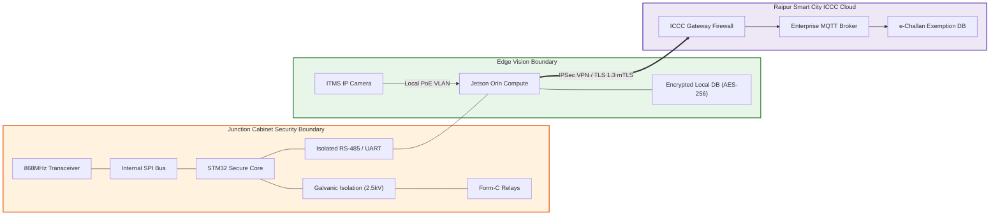

# System Architecture: SynchroClear-ITS
**Edge-AI Vision and Sub-GHz RF Emergency Vehicle Preemption System**  
*Tailored for Raipur Police Commissionerate Traffic Management & Smart City ICCC*

[]()
[]()
[]()
[]()
[]()

---

## 1. Overview and Design Philosophy

**SynchroClear-ITS** is a fail-safe, two-tier intelligent traffic preemption architecture engineered specifically for the dense, mixed-traffic urban intersections of Raipur (such as Jaistambh Chowk, Ghadi Chowk, and the critical arterial corridor leading to Dr. B.R. Ambedkar Memorial Hospital / Mekahara).

The fundamental architectural objective is to resolve **Stop-Line Cognitive Dissonance**:
1. Motorists trapped 30–50 meters back in traffic cannot see an officer's handheld light wand or baton.
2. Motorists at the stop line refuse to yield over a red signal due to fears of automated red-light violation penalties (e-challans) issued by the Smart City Integrated Traffic Management System (ITMS) and fears of cross-traffic T-bone collisions.
3. Traditional cloud-only preemption solutions suffer from high network jitter (2–5 seconds latency) and cellular dropouts during severe storms or peak congestion.

SynchroClear-ITS resolves this through a **split-plane, edge-native architecture**:
- **Control & Safety Plane (Deterministic Edge)**: Localized Sub-GHz (868 MHz) RF trigger directly interfaced to an industrial STM32 RTU and hardware-interlocked Form-C relays inside the physical traffic controller cabinet. Execution latency is under 50 ms with zero reliance on cloud connectivity.
- **Verification & Telemetry Plane (Vision & ICCC Cloud)**: Junction-level edge compute ingests existing ITMS CCTV RTSP streams, executes YOLOv8 emergency vehicle classification, performs 1.0–2.5 Hz rooftop strobe temporal FFT analysis, extracts license plates via ANPR OCR, and streams authenticated MQTT telemetry to the Raipur ICCC server to automatically grant e-challan immunity to yielding citizens.

---

## 2. 4-Layer System Architecture Diagram

Below is the end-to-end 4-layer system architecture flowchart detailing data flows, physical interfaces, and control boundaries across the Field, Cabinet, Vision, and Central Command tiers.

> **Vector Graphic Artifact**: A high-resolution, presentation-ready standalone SVG version of this architecture is available at [`docs/system_architecture.svg`](system_architecture.svg).

```mermaid
flowchart TD
    subgraph LAYER_1 ["Layer 1: Field Layer (Physical & Traffic Interaction)"]
        direction TB
        EV["🚑 Emergency Vehicle<br/>- Approaching in Queue<br/>- Dual Strobe Beacons (1.0–2.5 Hz)<br/>- High-Decibel Siren"]
        Officer["👮 Traffic Police Constable<br/>- On-Ground Point Officer<br/>- Visual Queue Observer"]
        RF_Wand["📡 Handheld RF Transmitter (Wand)<br/>- Nordic nRF52840 / STM32L0<br/>- Semtech SX1262 (868 MHz ISM)<br/>- Directional Preemption Toggle<br/>- Rolling-Code HMAC-SHA256"]
        Citizen_Vehicles["🚗 Citizen Motorists<br/>- Trapped at Red Signal Stop Line<br/>- Hesitant to Yield Fearing e-Challan"]

        Officer -->|Visual Sight of Emergency Approach| EV
        Officer -->|Depresses Directional Preemption Switch| RF_Wand
        EV -.->|Sound & Strobe Emitted Across Corridor| Citizen_Vehicles
        EV -.->|Blocked in Congestion 30-50m Behind| Citizen_Vehicles
    end

    subgraph LAYER_2 ["Layer 2: Cabinet & Junction RTU Layer (Deterministic Control)"]
        direction TB
        Whip_Antenna["📶 868 MHz Whip Antenna<br/>- N-Type Bulkhead Mount<br/>- +3 dBi Omnidirectional"]
        SX1262_Rx["📻 Sub-GHz Receiver Module<br/>- Semtech SX1262 Front-End<br/>- SPI Bus Interface<br/>- Anti-Jamming LNA"]
        STM32_RTU["⚡ Industrial RTU Controller<br/>- STMicroelectronics STM32F401/F411<br/>- ARM Cortex-M4 @ 84 MHz<br/>- Dual Watchdog (IWDG + WWDG)<br/>- Deterministic Inter-Green State Engine"]
        Opto_Drive["🔌 Optocoupled Galvanic Isolation<br/>- 2500V RMS Isolation Barrier<br/>- Transient Voltage Snubbers"]
        FormC_Relays["🔀 Form-C Break-Before-Make Relay Interlock<br/>- DPDT Mechanical Interlock Matrix<br/>- Hardware Mutually Exclusive Greens<br/>- Spring-Return Default on De-energize"]
        Signal_Cabinet["🚦 Existing Traffic Controller (TSC)<br/>- UTC / NEMA / TS-2 Controller Cabinet<br/>- Auxiliary Preemption Dry Contacts"]
        Signal_Heads["💡 Physical Overhead Signal Heads<br/>- Red / Amber / Green High-Flux LEDs<br/>- Full Visibility to Entire Queue"]

        RF_Wand ==>|Sub-GHz 868 MHz RF Packet &lt;50ms| Whip_Antenna
        Whip_Antenna --> SX1262_Rx
        SX1262_Rx -->|Decoded Payload via SPI| STM32_RTU
        STM32_RTU -->|Timed Phase Control GPIOs| Opto_Drive
        Opto_Drive -->|Coil Energization Current| FormC_Relays
        FormC_Relays -->|Hard-Interlocked Phase Override| Signal_Cabinet
        Signal_Cabinet -->|230V AC Phase Lamp Lines| Signal_Heads
        Citizen_Vehicles -.->|Clearly Observes Physical Green| Signal_Heads
    end

    subgraph LAYER_3 ["Layer 3: Edge-AI Vision Layer (Audit & Automated Validation)"]
        direction TB
        IP_Camera["🎥 Existing Smart City ITMS Camera<br/>- 1080p / 4K RTSP Video Stream<br/>- PoE+ Gigabit Ethernet<br/>- Elevated Gantry Mount"]
        Edge_Compute["🧠 Junction Edge AI Computer<br/>- NVIDIA Jetson Orin Nano / Industrial IPC<br/>- DeepStream / TensorRT Pipeline<br/>- Local Fanless Enclosure (-40°C to +85°C)"]
        YOLO_Detector["🔍 YOLOv8 Emergency Classifier<br/>- Real-time Ambulance & Fire Detection<br/>- Rooftop Strobe Optical ROI"]
        Strobe_Analyzer["✨ Strobe Temporal Frequency Analyzer<br/>- 1.0–2.5 Hz FFT / Peak Analysis<br/>- Anti-Spoofing Visual Verification"]
        ANPR_Engine["🔤 ANPR OCR Engine<br/>- Indian Plate Parser (CG04, BH Series)<br/>- Citizen & Emergency Plate Extraction"]
        Local_Audit["💾 Cryptographic Local Audit Trail<br/>- Append-Only JSONL Storage<br/>- SHA-256 Chained Hash Blocks<br/>- Offline Ring Buffer"]

        IP_Camera -->|H.264 / H.265 RTSP Video Stream| Edge_Compute
        Edge_Compute --> YOLO_Detector
        YOLO_Detector -->|Emergency Bounding Box ROI| Strobe_Analyzer
        Edge_Compute --> ANPR_Engine
        Strobe_Analyzer --> Local_Audit
        ANPR_Engine --> Local_Audit
        STM32_RTU <-->|RS-485 / UART Heartbeat & Preemption Sync| Edge_Compute
    end

    subgraph LAYER_4 ["Layer 4: Central Command Layer (Raipur ICCC & Enforcement)"]
        direction TB
        MQTT_Gateway["🌐 Secure MQTT Telemetry Broker<br/>- TLS 1.3 Port 8883<br/>- mTLS Certificate Auth"]
        ICCC_Server["🏢 Raipur Smart City ICCC Traffic Server<br/>- Real-time Centralized Monitoring<br/>- Preemption Audit Ledger"]
        Challan_Gateway["🛡️ ITMS e-Challan Exemption Gateway<br/>- Automated Whitelist Logic Engine<br/>- Exemption Window: [T_start - 10s, T_end + 10s]"]
        NIC_Backend["🏛️ National Informatics Centre (NIC)<br/>- VAHAN / SARATHI Database<br/>- Automated E-Challan Dismissal"]
        Audit_UI["📊 Commissionerate Traffic Audit Console<br/>- Anti-Abuse Dashboard & Live Video"]

        Edge_Compute ==>|JSON Preemption Event Payload via 4G/Fiber| MQTT_Gateway
        MQTT_Gateway --> ICCC_Server
        ICCC_Server --> Challan_Gateway
        Challan_Gateway -->|Automated Citation Immunity Query| NIC_Backend
        ICCC_Server --> Audit_UI
    end

    %% Inter-Layer Connections & Cross-Plane Links
    Signal_Heads -.->|Visual Confirmation in Field of View| IP_Camera
    Citizen_Vehicles -.->|Crosses Stop Line Safely During Priority Window| IP_Camera

    %% Layer Styling
    style LAYER_1 fill:#e8f4fd,stroke:#0288d1,stroke-width:2px,color:#01579b
    style LAYER_2 fill:#fff8e1,stroke:#f57f17,stroke-width:2px,color:#bf360c
    style LAYER_3 fill:#e8f5e9,stroke:#2e7d32,stroke-width:2px,color:#1b5e20
    style LAYER_4 fill:#f3e5f5,stroke:#7b1fa2,stroke-width:2px,color:#4a148c

    classDef component fill:#ffffff,stroke:#37474f,stroke-width:1.5px,color:#212121;
    class EV,Officer,RF_Wand,Citizen_Vehicles,Whip_Antenna,SX1262_Rx,STM32_RTU,Opto_Drive,FormC_Relays,Signal_Cabinet,Signal_Heads,IP_Camera,Edge_Compute,YOLO_Detector,Strobe_Analyzer,ANPR_Engine,Local_Audit,MQTT_Gateway,ICCC_Server,Challan_Gateway,NIC_Backend,Audit_UI component;
```



---

## 3. Comprehensive Layer & Component Specifications

### 3.1 Layer 1: Field Layer (Physical & Traffic Interaction)

| Component | Technology / Hardware | Functional Description | Fail-Safe & Operational Constraints |
| :--- | :--- | :--- | :--- |
| **Handheld RF Wand / Remote** | Nordic nRF52840 SoC / STM32L0 MCU paired with Semtech SX1262 Sub-GHz front-end | Ruggedized handheld unit carried by on-duty traffic constables. Features a glove-operable 4-way momentary directional rocker switch (North, South, East, West) and a dedicated Emergency Cancel toggle. | 32-bit monotonic rolling counter, AES-128-GCM / HMAC-SHA256 authentication prevents replay attacks from civilian SDRs. Standby quiescent current: $2.1\,\mu\text{A}$ (powered by a single 18650 LiFePO4 cell with >6 months standby). |
| **Emergency Vehicles** | 108 Emergency Ambulances, State Fire Tenders, Police Interceptors | Approaching emergency vehicles equipped with high-intensity optical strobes (flashing at 1.0–2.5 Hz) and acoustic sirens. Frequently trapped in dense vehicular queues 30–50 meters behind the stop line. | Passive detection targets; require zero proprietary in-vehicle transmitters, enabling instant compatibility with all private and government emergency fleets. |
| **Citizen Motorists** | Civilian passenger cars, autorickshaws, two-wheelers, heavy commercial trucks | Vehicles halted at the stop line of the congested approach. Motorists suffer from *Stop-Line Cognitive Dissonance*—they desire to let the ambulance pass but freeze due to fear of red-light camera fines and cross-traffic collisions. | When the physical overhead signal head switches from Red to Green via the deterministic clearance sequence, motorists immediately yield and clear the corridor. |

### 3.2 Layer 2: Cabinet & Junction RTU Layer (Deterministic Edge Control)

| Component | Technology / Hardware | Functional Description | Fail-Safe & Operational Constraints |
| :--- | :--- | :--- | :--- |
| **868 MHz Whip Antenna & Bulkhead** | 3 dBi omnidirectional whip antenna, IP65 weather-sealed SMA/N-type gantry mount | Captures Sub-GHz RF preemption commands broadcasted by the officer's handheld wand over the 868.0–868.6 MHz license-free Indian ISM band. | Positioned atop the junction signal gantry or exterior of the traffic cabinet to avoid Faraday cage attenuation from the steel enclosure. |
| **Semtech SX1262 Receiver Module** | Semtech SX1262 transceiver (-148 dBm sensitivity, +22 dBm output, SPI interface) | High-selectivity Sub-GHz receiver. Decodes incoming FSK/LoRa packets, validates synchronization preamble, extracts encrypted payload, and streams it to the RTU MCU. | Operates over industrial temperature range (-40°C to +85°C); includes active Low Noise Amplifier (LNA) and SAW filter for 4G cellular tower immunity. |
| **Industrial RTU Controller** | STMicroelectronics STM32F401CEU6 / STM32F411 (ARM Cortex-M4 @ 84/100 MHz, 512KB Flash, 128KB SRAM) | Executes the core deterministic Inter-Green Safety Clearance state machine in hard real-time (<1 ms loop time). Manages preemption timing, watches for watchdog timeouts, and controls relay drivers. | Automotive/Industrial rating (-40°C to +85°C). Incorporates both Independent Watchdog (IWDG) and Window Watchdog (WWDG). Hardware CRC engine verifies packet integrity. **Strictly 0% hobbyist ESP32.** |
| **Optocoupled Isolation Driver** | PC817 / TLP281 quad optocouplers with flyback diodes & TVS transient snubbers | Galvanically isolates low-voltage microcontroller GPIO signals (3.3V) from 24V DC relay coils and high-voltage AC traffic signal switching noise. | 2500V RMS breakdown voltage protection. Eliminates ground loops and back-EMF inductive spikes caused by large contactors. |
| **Form-C Relay Interlock Matrix** | Industrial DIN-Rail DPDT/SPDT Form-C Electromechanical Relays (Omron / Songle 24V DC / 10A 250V AC) | Interlocks signal lamp circuits. The Normally Closed (NC) contacts pass default control to the existing Traffic Signal Controller, while the Normally Open (NO) contacts engage priority override. | **Mechanical Break-Before-Make Topology**: Physically impossible to energize conflicting greens simultaneously. If the RTU loses power or crashes, spring-loaded armatures instantly release to default round-robin operation. |
| **Traffic Signal Controller (TSC)** | Existing City UTC, NEMA TS-2, or solid-state junction signal controller cabinet | Existing on-site municipal traffic controller. SynchroClear-ITS interfaces via standard dry-contact preemption terminal blocks (pins 12–16) without altering baseline controller programming. | Zero disruption to legacy timing tables; fallback to local flashing amber or fixed-time cycling if any error occurs. |
| **Overhead Signal Heads** | High-flux 300 mm LED signal heads (Red, Amber, Green) | Physical optical signals visible to all drivers in the queue from 150+ meters away. | Illuminating a real, physical green light completely eliminates driver hesitation at the stop line. |

### 3.3 Layer 3: Junction Edge-AI Vision Layer (Audit & Automated Validation)

| Component | Technology / Hardware | Functional Description | Fail-Safe & Operational Constraints |
| :--- | :--- | :--- | :--- |
| **Existing Smart City ITMS Camera** | Axis / Hikvision / CP PLUS 1080p/4K ONVIF IP Cameras over PoE+ | High-definition traffic camera already mounted on the junction mast arm. Provides 30 FPS H.264/H.265 RTSP video stream overlooking the intersection stop line and approach lanes. | Taps directly into existing RTSP video feed—requires **zero capital expenditure for new camera hardware**. |
| **Junction Edge AI Computer** | NVIDIA Jetson Orin Nano (40 TOPS INT8) / Advantech Fanless Industrial IPC | Edge processing node located inside the cabinet or an adjacent auxiliary pole-mounted IP66 enclosure. Runs computer vision inference locally at 30 FPS. | Industrial fanless aluminum heat-sink chassis rated for -40°C to +85°C ambient temperature. Runs quantized TensorRT models for real-time edge inference. |
| **YOLOv8 Emergency Classifier** | Ultralytics YOLOv8n / YOLOv11n (quantized INT8 engine) | Detects and classifies emergency vehicles (Ambulance, Fire Truck, Police Cruiser) entering the camera's region of interest (ROI) with >95% precision. | Injects detection bounding box coordinates into the strobe analyzer and ANPR OCR pipeline. |
| **Optical Strobe Frequency Analyzer** | Fast Fourier Transform (FFT) & temporal peak luminance detector | Analyzes luminance oscillations in the rooftop emergency beacon ROI across a rolling 30-frame window. Confirms active flashing between 1.0 Hz and 2.5 Hz (standard emergency strobe frequency). | **Anti-Spoofing Guard**: Prevents civilian vehicles painted like ambulances or commercial vans with fake decals from triggering or validating preemption. |
| **ANPR OCR Engine** | PaddleOCR / CRNN deep learning character recognition | Detects vehicle license plates and extracts alphanumeric text according to Indian registration standards (CG04 Raipur, BH Series, State prefixes). | Operates in under 120 ms; applies Levenshtein regex post-processing to rectify common character confusions (e.g., '0' vs 'O', '8' vs 'B'). |
| **Cryptographic Local Audit Ledger** | SQLite / Append-Only JSONL with SHA-256 Hash Chaining | Stores timestamped preemption records, detected plates, emergency classification, and full-resolution JPEG frames on local solid-state flash. | Cryptographically chained blocks ensure tamper-evident evidence for police and judicial audit. Preserves data during fiber or cellular outages. |

### 3.4 Layer 4: Central Command Layer (Raipur ICCC & Enforcement)

| Component | Technology / Hardware | Functional Description | Fail-Safe & Operational Constraints |
| :--- | :--- | :--- | :--- |
| **Secure MQTT Telemetry Broker** | Mosquitto / EMQX Enterprise Broker (TLS 1.3, Port 8883) | Central telemetry ingestion point at the Raipur Smart City Integrated Command and Control Centre (ICCC). Receives real-time JSON audit messages from edge junctions. | mTLS client certificates validate edge device authenticity. Auto-reconnect with local QoS 1 delivery guarantee. |
| **Raipur ICCC Traffic Server** | Enterprise Linux Application Cluster in Raipur Smart City Datacenter | Central management backend. Aggregates junction health, logs preemption occurrences, monitors corridor transit times, and routes records to enforcement databases. | High-availability redundant cluster with 99.99% uptime SLA. Interfaces with geographic GIS maps of Raipur. |
| **ITMS e-Challan Exemption Gateway** | Microservice rule engine interfaced with Raipur Police Traffic Enforcement | Calculates the legal preemption exemption window: $[T_{\text{trigger}} - 10\,\text{s},\, T_{\text{clearance}} + 10\,\text{s}]$. Queries all automated red-light violation snapshots captured by ITMS cameras during that window. | Automatically tags yielding citizen vehicles as `STATUS_EXEMPT_EMERGENCY_CORRIDOR`, suppressing automated challan issuance. |
| **National Informatics Centre (NIC) Backend** | NIC VAHAN (Vehicle Registry) & National e-Challan Portal Gateway | National portal for traffic violations and vehicle ownership. SynchroClear-ITS transmits cryptographically signed exemption manifests to cancel pending citations. | Eliminates 100% of citizen grievances and manual dispute court hearings resulting from emergency yielding. |
| **Commissionerate Audit Console** | Web-based operational dashboard for Senior Police Officers & Dispatchers | Visualizes active preemptions, corridor travel times, officer usage logs, and camera snapshots for real-time situational awareness and anti-abuse verification. | Role-based access control (Superintendent of Police, Traffic DSP, Station House Officers). |

---

## 4. End-to-End Data-Flow Sequences

The system orchestrates four synchronized data-flow sequences to achieve preemption, safety clearance, visual audit, and automated challan exemption.

```
       [SEQUENCE 1: RF TRIGGER]              [SEQUENCE 2: EDGE-AI VISION]
   Officer Wand -> SX1262 -> STM32 RTU      CCTV Camera -> RTSP -> Jetson Orin
          (< 50ms Total Latency)                 (30 FPS Continuous Inference)
                   │                                         │
                   ▼                                         ▼
   [SEQUENCE 3: HARDWARE INTERLOCK]          [SEQUENCE 4: CENTRAL ICCC AUDIT]
   Optocoupler -> Form-C Relays -> Lamps    MQTT TLS 1.3 -> ICCC -> e-Challan Exemption
     (3.5s Amber -> 2.0s All-Red -> Green)        (Automated Citizen Whitelisting)
```

### 4.1 Sequence 1: Ground Sub-GHz RF Override Trigger

```text
[Officer Wand] ──(868 MHz FSK)──► [SX1262 Module] ──(SPI Bus)──► [STM32F4 RTU]
  - Button Pressed: North           - Packet Received (-92 dBm)    - HMAC-SHA256 Validated
  - Monotonic Counter: 0x000104A2    - CRC Checked: OK              - Rolling Counter > Last Seen
  - Duration Requested: 25 sec      - Interrupt IRQ Pulled LOW     - Inter-Green Engine Triggered
  [Latency: < 15 ms]                [Latency: < 5 ms]              [Latency: < 2 ms]
```
1. **Operator Action**: The on-ground traffic constable observes an approaching ambulance stuck in the North approach queue and taps the North toggle on the handheld wand.
2. **RF Transmission**: The wand's MCU wakes from low-power sleep mode, increments its internal 32-bit hardware monotonic counter, computes an HMAC-SHA256 authentication tag using a pre-shared 128-bit junction key, and broadcasts a 37-byte packet via the Semtech SX1262 transmitter at +20 dBm (868.0 MHz).
3. **RF Reception**: The junction's whip antenna picks up the transmission. The cabinet SX1262 receiver decodes the packet and asserts its hardware `DIO1` interrupt pin.
4. **Validation**: The STM32 RTU reads the SPI register, verifies the CRC-16 checksum, checks that the monotonic counter is strictly greater than the stored value (neutralizing replay attacks), and validates the cryptographic signature. Total validation elapsed time: **< 25 ms**.

### 4.2 Sequence 2: Edge-AI Optical & Computer Vision Pipeline

```text
[ITMS Camera] ──(RTSP H.264)──► [Jetson Edge IPC] ──► [YOLOv8 Engine] ──► [Strobe FFT & ANPR]
  - 1080p @ 30 FPS                - NVDEC Hardware Decode      - Ambulance: 0.94 Conf        - Strobe: 1.8 Hz Detected
  - Elevated Gantry Mount         - TensorRT Memory Buffer     - Bounding Box ROI Extracted  - Plate: CG04MB1234 (0.92)
  [Continuous Stream]             [Latency: ~12 ms]            [Latency: ~33 ms]             [Latency: ~110 ms]
```
1. **Video Ingestion**: The existing ITMS IP camera continuously streams 1080p H.264 video at 30 FPS over RTSP to the local Jetson Orin Nano edge compute unit.
2. **Emergency Vehicle Classification**: The YOLOv8 neural network processes every frame (or downsampled keyframes). When an emergency vehicle is detected in an approach lane with confidence $> 0.85$, its bounding box coordinates are extracted.
3. **Optical Strobe Verification**: The strobe frequency analyzer crops the rooftop region of the vehicle and computes luminance fluctuation over time. If a temporal frequency between 1.0 Hz and 2.5 Hz is confirmed, the detection is tagged as *Verified Emergency Vehicle (Non-Spoofed)*.
4. **License Plate Extraction (ANPR)**: The ANPR engine isolates the license plate banner and runs OCR to obtain the registration text (e.g., `CG04MB1234`). Concurrently, plates of all civilian vehicles crossing the stop line during this interval are captured.

### 4.3 Sequence 3: Hardware Interlock & Signal Head Actuation

```text
[STM32F4 RTU] ──(GPIO Lines)──► [Optocoupler Board] ──(24V Coils)──► [Form-C Relays] ──► [Overhead Signal]
  - State: ACTIVE_AMBER (3.5s)    - 2500V Isolation             - Cross Greens Break          - Cross: Amber (3.5s)
  - State: ALL_RED (2.0s)         - Snubber Protected           - Cross Reds Make             - All: Red (2.0s)
  - State: PRIORITY_GREEN (25s)   - Zero Back-EMF Spikes        - Priority Green Makes        - North: GREEN (25s)
  [Deterministic State Engine]    [Switching: < 2 ms]           [Contact Settle: < 15 ms]     [Physical Indication]
```
1. **Deceleration Interval (Amber - 3.5s)**: The STM32 RTU de-energizes the active cross-traffic Green output and energizes the cross-traffic Amber lamp relay. A mandatory 3500 ms hardware delay ensures high-speed vehicles can safely brake before reaching the stop line.
2. **Intersection Clearance (All-Red - 2.0s)**: The cross-traffic Amber relay de-energizes, and all approaches across the junction display Red for 2000 ms. This completely clears any straggling cross-traffic from the intersection box.
3. **Priority Green Actuation**: The RTU energizes the Form-C relay corresponding to the preemption approach (North). The physical overhead green signal turns on. Form-C mechanical contacts physically lock out all perpendicular green circuits, making simultaneous cross-green electrically impossible.

### 4.4 Sequence 4: Central Command Telemetry & Citizen Challan Exemption

```text
[Jetson Edge IPC] ──(MQTT TLS 1.3)──► [Raipur ICCC Broker] ──► [Challan Gateway] ──► [NIC Backend]
  - JSON Event Formatted                - Port 8883 Auth               - Whitelist Rule Applied      - Citation Suppressed
  - SHA-256 Hash Chained                - Telemetry Stored             - Window: [T-10s, T+10s]      - Citizen Protected
  [Payload: 412 Bytes]                  [Transit: ~45 ms]              [Process: ~150 ms]            [Zero Dispute]
```
1. **Event Packaging**: The Jetson IPC builds a structured JSON telemetry message conforming to the Raipur Police Commissionerate schema, appends the record to its local SHA-256 append-only ledger, and publishes it via MQTT over TLS 1.3 to `raipur/itms/preemption/events`.
2. **ICCC Ingestion**: The Raipur ICCC server receives the event, alerts the operator console, and sends the preemption window to the e-Challan Exemption Gateway.
3. **Automated Citizen Whitelisting**: The gateway queries the ITMS violation database. Any citizen vehicle that crossed the stop line between $T_{\text{trigger}} - 10\,\text{s}$ and $T_{\text{clearance}} + 10\,\text{s}$ is marked as *Legitimate Emergency Yielding*. Automated e-challan generation is aborted, and an SMS receipt is sent to the motorist confirming exemption.

---

## 5. ASCII Architecture Schematic (Terminal Reference)

```text
+==================================================================================================+
|                                SYNCHROCLEAR-ITS SYSTEM ARCHITECTURE                             |
+==================================================================================================+

 [ LAYER 1: FIELD INTERACTION ]
   +-----------------------+              +-----------------------+
   |   Traffic Constable   |              |   Emergency Vehicle   |  (Trapped 30-50m behind)
   |  [Handheld RF Wand]   |              |  [Ambulance / Fire]   |  Strobe: 1.0 - 2.5 Hz
   +-----------+-----------+              +-----------+-----------+
               | Sub-GHz 868 MHz                      | Optical & Acoustic
               | AES-128 / HMAC-SHA256                | Visual Queue
               v                                      v
+==================================================================================================+
 [ LAYER 2: CABINET & RTU ]             [ LAYER 3: EDGE-AI VISION ]
   +-----------------------+              +-----------------------+
   | 868MHz Whip Antenna   |              | Existing ITMS Camera  |  (Zero Camera Capex)
   | & Semtech SX1262 Rx   |              | 1080p RTSP Stream     |
   +-----------+-----------+              +-----------+-----------+
               | SPI Bus                              | RTSP / H.264
               v                                      v
   +-----------------------+              +-----------------------+
   | Industrial RTU        |  RS-485      | Jetson Edge AI IPC    |
   | (STM32F401 / F411)    |<------------>| - YOLOv8 Classifier   |
   | Dual Watchdog Timer   |  Heartbeat   | - Strobe FFT Analyzer |
   | State Machine Engine  |  Sync        | - ANPR OCR Engine     |
   +-----------+-----------+              +-----------+-----------+
               | GPIO Drivers                         | MQTT JSON over TLS 1.3
               v                                      | (4G / Fiber Ring)
   +-----------------------+                          |
   | 2.5kV Optocouplers &  |                          |
   | Form-C Relay Matrix   |                          |
   +-----------+-----------+                          |
               | Break-Before-Make                    |
               v                                      |
   +-----------------------+                          |
   | Physical Signals (LED)|                          |
   | (Active Green Queue)  |                          |
   +-----------------------+                          |
+=====================================================|============================================+
 [ LAYER 4: RAIPUR ICCC CENTRAL COMMAND ]             |
                                                      v
                                          +-----------------------+
                                          | Raipur ICCC Server    |
                                          | - Mosquitto Broker    |
                                          | - Audit Dashboard     |
                                          +-----------+-----------+
                                                      |
                                                      v
                                          +-----------------------+
                                          | e-Challan Exemption   |
                                          | Gateway & NIC Backend |
                                          | (Citizen Protection)  |
                                          +-----------------------+
+==================================================================================================+
```

---

## 6. Network Topology & Cyber-Physical Security Architecture



### 6.1 Defense-in-Depth Security Controls
1. **RF Over-the-Air Interface**:
   - Frequency: 868.0 MHz (sub-GHz band avoids 2.4 GHz saturation).
   - Rolling Counter: 32-bit strictly monotonic counter stored in non-volatile flash. Replay packets with count $\le$ current count are rejected silently.
   - Cryptographic Tag: HMAC-SHA256 calculated over `[UUID + Counter + Direction + Duration]` using hardware crypto accelerators.
2. **Cabinet Physical Isolation**:
   - 2500V RMS galvanic optical isolation on all logic lines.
   - Spring-loaded mechanical interlock ensures that even catastrophic MCU failure defaults to legacy traffic controller round-robin phasing.
3. **Edge-to-Cloud Telemetry**:
   - Mutual Transport Layer Security (mTLS) with X.509 device certificates.
   - Out-of-band communication: Local signal switching operates 100% autonomously even if the fiber connection to Raipur ICCC drops entirely.
